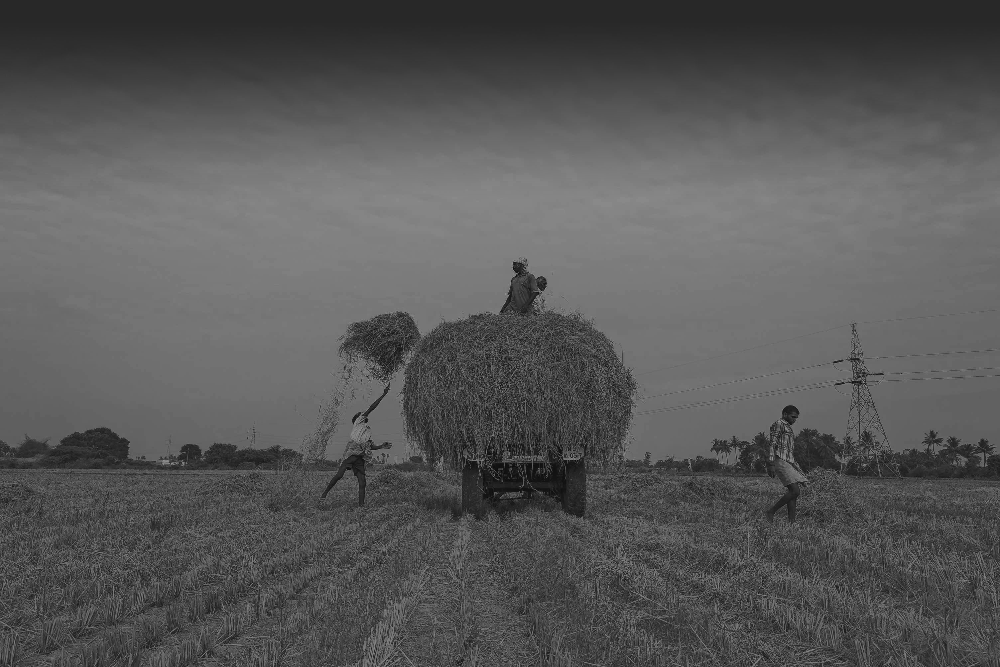

# 农/林/牧/渔 - 稻谷种植
{ align=right width="502" }

> 本条目指以收获稻谷为主的农作物的种植。 稻谷属于一年生禾本科作物，起源于中国。 在约 1.4 万年前，在长江流域出现最早的稻作栽培，如今中国的各个省份都能种植。 稻谷的种子就是我们常见的大米、糯米等， 是人们日常生活中的主要主食。

## 简介

### 起源

在约 1.4 万年前，在长江流域出现最早的稻作栽培，如今中国的各个省份都能种植。 稻谷的种子就是我们常见的大米、糯米等， 是人们日常生活中的主要主食。

## 种类

中国科学院上海生命科学研究院韩斌为首的研究团队，汇集出巨大数据库，用来比对稻米基因体（基因组）序列之细微变化。此数据库涵盖各地不同类型的普通野生稻（Oryza rufipogon）计446种，粳稻和籼稻共1,083种。野生稻是现在食用、贩卖稻米的原生种。若干理论认为籼稻与野生稻是各自独立栽培出来的，研究人员表示，透过拼出稻米品种的谱系，就能证明这种理论是错的。第一种籼稻应是由粳稻和野生稻杂交培育而成。这个杂交种后来传到东南亚、南亚，农民为适应各地环境，栽培出数种品种，因而产生独特的籼稻。

- 籼稻（Oryza sativa indica）：有20%左右为直链淀粉。属中黏性。籼稻起源于亚热带，种植于热带和亚热带地区，生长期短，在无霜期长的地方一年可多次成熟。去壳成为籼米后，外观细长、透明度低。有的品种表皮发红，如中国江西出产的红米，煮熟后米饭较干、松。通常用于萝卜糕、米粉、炒饭。广东人爱吃的丝苗米是籼稻的一种。为南亚、东南亚、中国南部地区主要食用米。
- 粳稻（Oryza sativa japonica）：粳稻的直链淀粉较少，低于15%。种植于温带和寒带地区，生长期长，一般一年只能成熟一次，台湾一般被认为是北半球粳稻生长最南区。去壳成为粳米后，外观圆短、透明（部分品种米粒有局部白粉质）。煮食特性介于糯米与籼米之间。为中国北部及台湾、日本、朝鲜半岛主要食用米。
- 糯稻（Oryza sativa var glutinosa）：支链淀粉含量接近100%，黏性最高。又分粳糯(圆糯)及籼糯(长糯)，粳糯外观圆短，籼糯外观细长，颜色均为白色不透明。煮熟后米饭较软、黏。粳糯常见用途为用于酿酒、米糕、红龟粿、甜粿、汤圆等。籼糯则作为八宝粥、粽子、油饭等原料。
> 引用自维基百科 [稻](https://zh.wikipedia.org/wiki/%E7%A8%BB) 词条

### 生态区划

### 华南湿热双季稻作区

位于南岭以南，包括云南省西南部，广东省、广西壮族自治区的中、南部，福建省东南部，台湾省以及海南省、福建省等地。本区稻田约占全国稻田面积的 17％，稻谷产量约占全国稻谷总产的 16％，均居全国第二位。

本区属热带和南亚热带湿润季风气候，高温多湿。稻作期间日平均气温 22～26℃，日较差 5.4～8.1℃，＞10℃的积温 6500～8000℃。稻作生长季达 260 天以上，山区比同纬度平原短 5～10 天。早稻安全播种期：2 月中旬至 3 月中旬；海南省南部可在 12 月播种，全年都能种稻，是中国水稻育种加代的重要基地；丘陵山地随海拔每增高 100 米，播种期推迟 3～7 天。晚稻安全齐穗期：9 月下旬至 10 月底；丘陵山地随海拔每增高 100 米，提早 2～5 天。稻作期间总日照时数 1400～2000 小时，日照百分率 40～60％，且由南向北递减；光合辐射总量 40～50 千卡／平方厘米，由南向北，自东到西递减，海南省为全国最高值。稻作季节雨量充沛，总降水量 1100～1600 毫米，但时空分布不匀，丘陵台地有明显春、秋干早。土壤多为冲积土、砖红壤、赤红壤等发育而成的水稻土。种植制度以双季稻为主，占稻田面积 80％以上。海南省南部的陵水、崖县有少量三季稻和冬稻种植。稻田复种轮作方式多样，有以双季稻与冬作物夏种的一年三熟制；有休闲田种植双季稻；有单季稻与甘薯、大豆、花生、甘蔗、黄麻等旱作物，复种的一年两熟制；有稻作与旱作实行年间轮换的水早轮作制。稻作品种以釉稻为主，山区和台湾省有粳稻种植。本区常有早稻播种和开花期间的低温阴雨，晚稻出穗、灌浆期的“寒露风”，春、秋干旱，夏季台风暴雨以及交替出现的病虫危害等。

### 华中湿润单、双季稻作区

位于淮河、秦岭以南，南岭以北。包括江苏、安徽省的中、南部，河南、陕西省的南缘，四川省东半部，浙江、湖南、湖北、江西诸省及上海市的全部，广东省和广西壮族自治区北部，福建省的中、北部。本区稻田约占中国稻田面积的 65.5％，稻谷产量约占中国稻谷总产的 66％，均居全国首位。

本区属中亚热带和北亚热带湿润季风气候，温暖湿润，四季分明。稻作期间日平均气温 21～25℃，日较差 6～10℃＞10℃积温 4500～6500℃，由南而北递减，东西差异不大；四川盆地南部积温稍多于同纬度的长江中、下游地区；丘陵山地海拔每升高 100 米，积温减少 100℃左右。稻作生长季为 200～260 天，丘陵山地短厂同纬度平原。早稻安全播种期：3 月中旬至 4 月中旬，由北而南逐渐提早；丘陵山地随海拔每增高 100 米，推迟 3～4 天。四川盆地因有秦岭、大巴山对寒流的阻挡，春温回升早于东部沿海地区，早稻播期比同纬度长江中、下游地区要早 10～15 天。晚稻安全齐穗期：9 月初至 10 月上旬，四川和汉中盆地比同纬度平原提前 5～10 天。稻作期间日照总时数 900～1600 小时，以四川盆地最少；日照百分率 30～50％，北多南少，沿海又少于内陆。稻作期的光合辐射总量 30～48 千卡／平方厘米，沿海与山地丘陵，因云雨较多，总辐射量偏少。稻作生长季节总降水量为 750～1300 毫米，北少南多，差异较大。平原为冲积土，土质肥沃，丘陵山地多由红壤、黄壤发育而成的水稻土，土质粘性大，有机质含量低，酸性强；低洼地区地下水位高，土壤次生潜育化严重。种植制度为单季稻、双季稻的过渡地带。北部沿淮和鄂北一带为单季稻区：中部的苏南、浙北平原、皖中平原、鄂中丘陵平原、汉中盆地及四川部分盆地为双季稻与单季稻混栽地区：再向南移，双季稻面积显著增多。丘陵山区的种植制度，因地域和海拔不同而有差异。中部的浙北、皖南海拔在 300 米以下，南部福建在 500 米以下，一般都可种双季稻。品种以籼稻占多数，杂交籼稻占有很大比重。太湖平原的单季稻和双季晚稻采用粳稻。本区由于气候的不稳定性，水、旱、风、雹及高、低温等多有发生。同时，病虫害种类多，常在生产上造成损害。

### 华北半湿润单季稻作区

位于秦岭、淮河以北，长城以南。包括辽宁省的辽东半岛，北京、天津两市，河北省的张家口至内蒙古自治区多伦一线以南部分，山西省全部，陕西省秦岭以北的东南大部分，宁夏回族自治区的固原以南的黄土高原，甘肃省兰州以东，河南省中北部，山东省全部，以及江苏、安徽两省的淮北地区。稻田面积约占中国稻田面积的8％，稻谷产量约占中国稻谷总产量的8％。

本区属暖温带半湿润季风气候，春季温度回升缓慢，秋季气温下降较快。稻作期间日平均气温 19～23℃，东部高于西部，南北差异较小；日较差 10～14℃；＞10℃的积温为 3500～4500℃，自南向北，由东向西逐渐减少。稻作生长季为 140～200 天，华北东部长于西北部和辽东半岛。安全播种期为 4 月 10 日至 4 月 25 日；安全齐穗期，8 月上旬至 8 月中下旬。稻作期间日照时数为 1200～1600 小时，日照百分率 46～60％，以华北平原为多。稻作生长季的光合辐射总量为 35～42 千卡／平方厘米，自西向东逐渐增大，海河一带为本区的高值区。稻作期间降水量一般为 400～800 毫米，东南多于西北，西部的兰州只有 288 毫米。降水季节分布不匀，春雨特少，主要集中在 6 月至 8 月，年际变率较大，多雨年平原洪涝成灾，少雨年干旱严重，致使稻作面积难以稳定。土壤是由草甸土、盐碱土，部分为褐土、栗钙土等发育而成的水稻土。其淋浴作用小，富含速效性矿物质养分。但因蒸发强烈，低地表土极易泛盐。陕西省关中及山西省汾河下游冲积平原，土壤疏松肥沃。种植制度以单季稻为主，淮北平原、海河地区多以一熟稻和麦稻两熟搭配种植，辽东半岛以一季中粳为主。品种在北部以早熟或中熟中粳为主;南部地区采用中籼、杂交籼稻。

### 东北半湿润早熟单季稻作区

位于辽东半岛西北，长城以北，大兴安岭以东地区。包括黑龙江省东部，吉林省，辽宁省的中北部。稻田面积约占全国稻田面积的 2.5％，稻谷产量约占全国稻谷总产的 3.0％。本区单产较高，米质优良，是商品优质米产区之一。

本区属中温带和寒温带半湿润季风气候，夏季温和湿润，冬季严寒漫长。稻作期间日平均气温 17～20℃，日较差 12℃左右；＞10℃积温小于 3500℃。黑龙江省北部只有 2000℃。稻作生长季 110～160 天，为全国最短。安全播种期自南向北为 4 月 25 日至 5 月 25 日。安全齐穗期为 7 月 20 日至 8 月 15 日。稻作生长期总日照时数 1000～1250 小时，日照百分率 55～60％，光合辐射总量 24～35 千卡／平方厘米，自北向南递增。降水量只有 300～600 毫米，西部少于东部。水分不足乃是影响稻作生产的主要限制因子。土壤多为草甸土、沼泽土、白浆土、盐碱土等发育而成的水稻土。种植制度均为一年一熟的单季早粳稻。栽培方法已由播向育苗移栽演变。品种为早熟早粳稻，南部为中、迟熟类型；北部为特早熟类型。低温冷害、秋涝春旱和稻瘟病等自然灾害，是使稻作生产不 稳的主要因素。

### 西北干燥单季稻作区

位于大兴安岭以西，长城、祁连山、青藏高原以北地区。包括黑龙江省大兴安岭以西，内蒙古自治区，甘肃省西北部，宁夏回族自治区的大部，陕西省北部，河北省北部，新疆维吾尔自治区。稻田面积只占中国稻田面积的 0.5％左右，稻谷产量占中国稻谷总产的 0.4％左右。

本区属中温带大陆性干燥气候，降水稀少，气温变化剧烈，但日照充足，光能资源丰富。稻作期间日平均气温 18～22℃，日较差是全国最大值区，达 11～14℃，有利光合产物积累。10℃积温 2200～4000℃。稻作生长季短，为 120～180 天，自北向南逐渐增加。安全播种期为 4 月 15 日至 5 月 5 日。安全齐穗期，地区差别很大，北疆 7 月中旬至 8 月初，南疆可到 8 月中下旬，河西走廊与银川平原 7 月下旬至 8 月上旬。稻作生长季日照时数为 1350～1600 小时，日照百分率除南疆的于田、和田外，均在 65～70％，为全国最高值区；光合辐射总量为 30～40 千卡／平方厘米，北部又比南部大。稻作生长季节降水量仅 30～350 毫米，为全国最少，其中又以南疆最少；东南部高原雨量略多，为 200～350 毫米。水源不足、霜冻早，是限制稻作生产的主要因素。但光照条件好，昼夜温差大，有利光合物质积累，易获高产。土壤多为草甸土、沼泽土、盐碱土发育而成的水稻土。以单季稻为主，部分地区也发展了稻麦两熟，或稻、麦、旱秋作物轮换的两年三熟。稻作品种类型较多，河西走廊、银川平原以中熟早粳为主；北疆以早熟早粳为多；南疆可用早熟中粳。

### 西南高原湿润单季稻作区

位于中国大陆西南部。包括贵州省大部，云南省中、北部，四川省北部的甘孜、阿坝，青海省以及西藏自治区的零星稻区。稻田面积约占中国稻田面积的 6.5％，稻谷产量约占中国稻谷总产的 6.6％。由于每个地方的每个品种的种植方式是不同的，很难对每个品种每个气候条件和地理环境一一详述，因此这里我们对水稻和旱稻分别做育苗和直播两种播种方式进行讲述。

### 水稻育苗

按灌溉水的管理方式不同，水稻育苗可分为三种方式，即水育苗、湿润育苗和旱育苗。

#### 水育苗

水整地水作床，带水播种，育苗全过程除防治绵腐病、坏种烂秧及露田扎根外，一直都建立水层。

#### 湿润育苗

水整地水作床湿播种，出苗后根据秧田缺水程度，间歇灌水，以湿为主。

#### 旱育苗

旱整地旱作床旱播种，人工浇水补水，整个育苗过程不建立水层，秧田后期可以沟灌润水或视情况灌跑马水。

按育苗方法不同，有裸地育苗和塑料薄膜保温育苗。保温育苗因栽培方法和地区不同，又有塑料大棚、中棚和隧道式拱棚育苗或平铺育苗。按播种下垫不同，有无土育苗和有土育苗，有露地播种育苗和隔离层育苗（软盘、钵盘、有孔地膜及其他物质）。有旱田、园田、庭院、大地高台及本田育苗。按保温材料不同，有塑料薄膜有孔、无孔薄膜覆盖、无纺布覆盖和地膜双层覆盖等育苗方式。有宽床、窄床育苗及开闭式上通风和下通风等育苗方式，具体应用哪种方式则应因地制宜，根据实际情况运用。

### 水稻直播

水稻直播即将烘干的水稻种子直接洒于秧田秧板，表层覆盖薄土

### 旱稻直播

旱稻,在旱作条件下能正常生长发育的稻品种。是指选用耐旱性较强的优质、高产水稻品种,采用旱直播,整个生育期以自然降雨为主,在生育的关键时期,遇干旱时要适当补给水分,使水稻在土壤比较湿润的状态下,正常生长发育,开花结实。

### 主料

水稻。

### 辅料

无

### 可选原料

籼稻谷，粳稻谷，糯稻谷

## 种植流程

### 选用优良品种

按照“优质、高产、抗病性强、适宜本地区种植”的要求。

### 施足底肥

底肥一般每亩施通用型复合肥 25-30 公斤，中化加钾 8-10 公斤，尿素 10 公斤。

- 磷、钾肥作底肥用，可以施得深些，满足水稻开花后对磷、钾养分的大量需要。追肥亩施尿素 10-15 公斤，分别在返青期和分蘖期施用。

### 精细整地

种稻之前，必须先将稻田的土壤翻过，使其松软，这个过程分为粗耕、细耕和盖平三个期间。过去使用兽力和犁具，主要是水牛或黄牛来整地犁田，但现在多用机器整地。

### 种子处理

前期收获的种子需在日光下或 30℃至 37℃左右的烘箱中烘干 3 天左右，接着将种子按要求放入网袋，网袋依次串于钢丝。将网袋浸没于洁净的水中 3 天，温度稍暖手最适，期间每 24 小时换水。第四天将种子从水中取出，保湿待播种。

### 适期播种

水稻于每年 5 月初至 6 月进行播种，将种子按照规定区域洒于秧板。

#### 育苗

农民先在某块田中培育秧苗，此田往往会被称为秧田，在撒下稻种后，农人多半会在土上洒一层稻壳灰；现代则多由专门的育苗中心使用育苗箱来使稻苗成长，好的稻苗是稻作成功的关键。在秧苗长高约 8 公分时，就可以进行插秧了。

#### 插秧

将秧苗仔细的插进稻田中，间格有序。传统的插秧法会使用秧绳、秧标或插秧轮，来在稻田中做记号。手工插秧时，会在左手的大拇指上戴分秧器，帮助农人将秧苗分出，并插进土里。插秧的气候相当重要，如大雨则会将秧苗打坏。现代多有插秧机插秧，但在土地起伏大，形状不是方型的稻田中，还是需要人工插秧。秧苗一般会呈南北走向。还有更为便利的抛秧。目前，先进的种植方法采用稀植或超稀植，密度基本固定在行距 30㎝，株距 20㎝左右（每平方米 16 穴）的范围内。

### 冬前和春季水肥

（一）东北寒地单季稻区（包括黑龙江省全部以及内蒙古自治区呼伦贝尔市的部分县）

1. 施肥原则
	- 根据测土配方施肥的结果适当减少氮磷肥用量，优化钾肥用量。
	- 减少基蘖肥氮量和比例，增加穗肥比例，使拔节期穗肥氮比例达到 30% 左右。
	- 早施返青肥促分蘖早发，插秧后 3 天内施用返青肥。
	- 根据土壤中微量元素养分状况适当补充中微量元素。
	- 偏酸性地块应施用钙镁磷肥，偏碱性地块基肥选用pH较低的复合肥或复混肥，少用或不用尿素作追肥，可采用硫酸铵作追肥。
	- 基肥施用后旱旋耕，实现全层施肥；采用节水灌溉技术，施肥前晒田 3 天左右，施肥以水带氮。
	- 有条件地区推荐采用机插侧深机施底肥和蘖肥，实现施肥插秧一体化。
2. 施肥建议
	- 推荐 14-16-15（N-P2O5-K2O）或相近配方。
	- 产量水平 450-550 公斤/亩，配方肥 18-23 公斤/亩，分蘖肥和穗粒肥分别追施尿素 5-7、3 公斤/亩。
	- 产量水平 550 公斤/亩以上，配方肥 23-29 公斤/亩、硫酸锌 1-2 公斤/亩，分蘖肥和穗粒肥分别追施尿素 7-8、3-4 公斤/亩，穗粒肥追施氯化钾 1-3 公斤/亩，补充硅肥。
	- 产量水平 450 公斤/亩以下，配方肥 14-18 公斤/亩，分蘖肥和穗粒肥分别追施尿素 4-5、2-3 公斤/亩。

（二）东北吉辽蒙单季稻区 （包括吉林、辽宁两省全部以及内蒙古自治区的赤峰、通辽和兴安盟三市（盟）的部分县）

1. 施肥原则
	- 根据测土配方施肥结果和品种需肥特性确定地块合理肥料用量。
	- 控制氮肥总量、合理分配氮肥施用时期，适当增加穗肥比例。
	- 合理施用磷肥和钾肥，适当补充中微量元素肥料。
	- 在提高有机肥的施用数量基础上、适当减少后期氮肥用量。
	- 有条件地区推荐采用机插侧深机施底肥和蘖肥，实现施肥插秧一体化。
2. 施肥建议
	- 推荐15-16-14（N-P2O5-K2O）或相近配方。
	- 产量水平 500-600 公斤/亩，配方肥 24-28 公斤/亩、硫酸锌 1-2 公斤/亩，分蘖肥和穗粒肥分别追施尿素 8-9、4-5 公斤/亩，补充硅肥 10-15 公斤/亩。
	- 产量水平 600 公斤/亩以上，配方肥 28-33 公斤/亩、硫酸锌 1-2 公斤/亩，分蘖肥和穗粒肥分别追施尿素 9-11、5 公斤/亩，穗粒肥追施氯化钾 1-3 公斤/亩，补充硅肥15-20公斤/亩。
	- 产量水平 500 公斤/亩以下，配方肥推荐用量 19-24 公斤/亩，分蘖肥和穗粒肥分别追施尿素 6-8、3-4 公斤/亩。

（三）长江上游单季稻区 （包括四川省东部，重庆市全部，陕西省南部，贵州省北部的部分县，湖北省西部）

1. 施肥原则
	- 增施有机肥，提倡有机无机相结合。
	- 根据土壤肥力情况，适当调整基肥与追肥比例。
	- 基肥深施，追肥“以水带氮”。
	- 在油稻轮作田，适当减少水稻磷肥用量。
	- 选择中低浓度磷肥，如钙镁磷肥和普钙等；钾肥选择氯化钾。
	- 在土壤 pH 5.5 以下的田块，适当施用含硅的碱性肥料或基施生石灰。
	- 有条件地区推荐采用机插侧深机施底肥和蘖肥，实现施肥插秧一体化。
2. 施肥建议
	- 产量水平 450 公斤/亩以下，氮肥（N）用量 6-8 公斤/亩；产量水平 450-550 公斤/亩，氮肥（N）用量 8-10 公斤/亩；产量水平 550-650 公斤/亩，氮肥（N）用量 10-12 公斤/亩；产量水平 650 公斤/亩以上，氮肥（N）用量12-14 公斤/亩。磷肥（P2O5）4-6 公斤/亩，钾肥（K2O）5-8 公斤/亩（秸秆还田的中上等肥力田块钾肥用量 4-7 公斤/亩）。
	- 氮肥基肥占 50%-60%，蘖肥占 20%-30%，穗肥占 20%-30%；有机肥与磷肥全部基施；钾肥分基肥（占 50%-60%）和穗肥（占 40%-50%）两次施用。
	- 在缺锌和缺硼地区，适量施用锌肥和硼肥；在土壤酸性较强田块每亩基施含硅碱性肥料或生石灰30-50公斤。

（四）长江中游单双季稻区 （包括湖北省中东部，湖南省东北部，江西省北部，安徽省全部）

1. 施肥原则
	- 适当降低氮肥、磷肥总用量，增加氮肥穗肥比例。
	- 基肥深施，追肥“以水带氮”。
	- 磷肥优先选择普钙或钙镁磷肥，钾肥选择氯化钾。
	- 增施有机肥料，提倡秸秆还田。
	- 配合施用锌肥与硅肥。
	- 有条件地区推荐采用机插侧深机施底肥和蘖肥，实现施肥插秧一体化。
2. 施肥建议
	- 产量水平 350 公斤/亩以下，氮肥（N）用量 6-7 公斤/亩；产量水平 350-450 公斤/亩，氮肥（N）用量 7-8 公斤/亩；产量水平 450-550 公斤/亩，氮肥（N）用量 8-10 公斤/亩；产量水平 550 公斤/亩以上，氮肥（N）用量 10-12 公斤/亩。磷肥（P2O5）4-7 公斤/亩，钾肥（K2O）4-8 公斤/亩。
	- 氮肥50%-60%作为基肥，20%-25% 作为蘖肥，20%-25% 作为穗肥；磷肥全部作基肥；钾肥 50%-60% 作为基肥，40%-50% 作为穗肥；在缺锌地区，适量施用锌肥（硫酸锌）1公斤/亩；适当基施含硅肥料；有机肥基施。
	- 施用有机肥或种植绿肥翻压的田块，基肥用量可适当减少；在常年秸秆还田的地块，钾肥用量可适当减少30%左右。

（五）长江下游单季稻区（包括江苏省全部，浙江省北部）

1. 施肥原则
	- 增施有机肥，有机无机相结合。
	- 控制氮肥总量，调整基肥及追肥比例，适当减少基肥氮肥用量。
	- 基肥深施，追肥“以水带氮”。
	- 油（麦）稻轮作田，适当减少水稻磷肥用量。钾肥选择氯化钾。
	- 有条件地区推荐采用机插侧深机施底肥和蘖肥，实现施肥插秧一体化。
2. 施肥建议
	- 产量水平 500 公斤/亩以下，氮肥（N）用量 8-10 公斤/亩，磷肥（P2O5）2-3 公斤/亩；钾肥（K2O）3-4 公斤/亩；产量水平 500-600 公斤/亩，氮肥（N）用量 10-12 公斤/亩，磷肥（P2O5）3-4 公斤/亩；钾肥（K2O）4-5 公斤/亩；
	- 产量水平 600 公斤/亩以上，氮肥（N）用量 12-18 公斤/亩。磷肥（P2O5）5-6 公斤/亩；钾肥（K2O）6-8 公斤/亩，锌肥（硫酸锌）1-2 公斤/亩。
	- 氮肥基肥占 40%-50% 左右，蘖肥占 20%-30%，穗肥占 20%-30%；有机肥与磷肥全部基施；钾肥分基肥（占 50%-60% ）和穗肥（占 40%-50% ）两次施用。缺锌土壤每亩施用硫酸锌 1-2 公斤；适当基施含硅肥料。
	- 施用有机肥或种植绿肥翻压的田块，基肥用量可适当减少。

（六）江南丘陵山地单双季稻区（包括湖南省中南部，江西省东南部，浙江省南部，福建省中北部，广东省北部）

1. 施肥原则
	- 根据土壤肥力确定目标产量，控制氮肥总量，氮磷钾平衡施用，有机无机相结合。
	- 基肥深施，追肥“以水带氮”。
	- 磷肥优先选择钙镁磷肥或普钙。
	- 酸性土壤适当施用土壤改良剂或基施生石灰。
	- 锌缺乏地区注意合理施用锌肥。
	- 有条件地区推荐采用机插侧深机施底肥和蘖肥，实现施肥插秧一体化。
2. 施肥建议
	- 在亩产 500 公斤左右条件下，氮肥（N）10-13 公斤/亩，磷肥（P2O5）3-4 公斤/亩；钾肥（K2O）8-10 公斤/亩。
	- 氮肥分次施用，基肥占 35%-50%，分蘖肥占 25%-35%，穗肥占 20%-30%，分蘖肥适当推迟施用；磷肥全部基施；钾肥 50% 作为基肥，50% 作为穗肥，或者钾肥 35% 作为基肥，40% 作为分蘖肥，20% 作为穗肥。
	- 推荐秸秆还田或增施有机肥。常年秸秆还田的地块，钾肥用量可适当减少 30%；施用有机肥的田块，基肥用量可适当减少。
	- 在土壤酸性较强田块上，整地时每亩施含硅碱性肥料或生石灰 40-50 公斤。
	- 在缺锌地区，适量施用锌肥。

（七）华南平原丘陵双季早稻（包括广西壮族自治区南部，广东省南部，海南省全部，福建省东南部）

1. 施肥原则
	- 控制氮肥总量，调整基、追比例，减少前期氮肥用量，实行氮肥后移。
	- 基肥深施，追肥“以水带氮”。
	- 磷肥优先选择钙镁磷肥或普钙。
	- 在土壤 pH 5.5 以下的田块，适当施用含硅的碱性肥料或基施生石灰。
	- 缺锌田块、潜育化稻田和低温寡照地区补充微量元素锌肥。
	- 有机无机配施，提倡秸秆还田。
	- 有条件地区推荐采用机插侧深机施底肥和蘖肥，实现施肥插秧一体化。
2. 施肥建议
	- 推荐 18-12-16（N- P2O5-K2O）或相近配方。
	- 亩产水平 350-450 公斤，配方肥 25-30 公斤/亩，分蘖肥和穗粒肥分别追施尿素 5-7 公斤/亩、3-5 公斤/亩。
	- 亩产水平 450-550 公斤，配方肥 30-35 公斤/亩，分蘖肥和穗粒肥分别追施尿素 7-10 公斤/亩、4-7 公斤/亩。
	- 亩产水平 550 公斤以上，配方肥 35-40 公斤/亩，分蘖肥和穗粒肥分别追施尿素 8-11 公斤/亩、5-8 公斤/亩。
	- 亩产水平 350 公斤以下，配方肥 20-25 公斤/亩，分蘖肥和穗粒肥分别追施 4-6 公斤/亩、3-5 公斤/亩。

（八）西南高原山地单季稻区（包括云南省全部，四川省西南部，贵州省大部，湖南省西部，广西壮族自治区北部）

1. 施肥原则
	- 增施有机肥，实施秸秆还田，有机无机相结合。
	- 调整基肥与追肥比例，减少前期氮肥用量。
	- 缺磷土壤，应适当增施磷肥；以选择钙镁磷肥最佳。
	- 供钾能力低的稻田，注意水稻生长后期补钾。
	- 在土壤 pH 5.5 以下的田块，适当施用含硅钙的碱性土壤改良剂或基施生石灰。
	- 肥料施用与高产优质栽培技术相结合。
2. 施肥建议
	- 推荐 17-13-15（N- P2O5-K2O）或相近配方。
	- 产量水平 400-500 公斤/亩，配方肥 26-33 公斤/亩，分蘖肥和穗粒肥分别追施尿素 6-7、4-5 公斤/亩。
	- 产量水平 500-600 公斤/亩，配方肥 33-39 公斤/亩，分蘖肥和穗粒肥分别追施尿素 7-8、5-6 公斤/亩，穗粒肥追施氯化钾 1-2 公斤/亩。
	- 产量水平 600 公斤/亩以上，配方肥 39-46 公斤/亩，分蘖肥和穗粒肥分别追施尿素 8-10、6-7 公斤/亩，穗粒肥追施氯化钾 2-4 公斤/亩。
	- 产量水平 400 公斤/亩以下，配方肥 20-26 公斤/亩，分蘖肥和穗粒肥分别追施尿素 4-6、3-4 公斤/亩。
	- 在缺锌地区，每亩施用 1-2 公斤硫酸锌；在土壤 pH 较低的田块每亩基施含硅碱性肥料或生石灰 30-50 公斤。

### 根外追肥

### 病虫害管理

#### 常见病害

- 稻瘟病
- 白叶枯病
- 黑条矮缩病
- 恶苗病
- 纹枯病
	- 防治:7月15&sim;25日:根据田间病虫发生情况,选用啶虫脒(1.5 g/包),4 包/亩,戊唑多菌灵(10 g/包),2 包/亩防治纹枯病
- 稻曲病

#### 常见虫害

- 稻飞虱
	- 防治:7 月 15&sim;25 日:根据田间病虫发生情况,选用啶虫脒(1.5 g/包),4 包/亩防治第三代稻飞虱
	- 8 月中下&sim;9 月上旬:选用啶虫脒(1.5 g/包),4 包/亩,防治第四代稻飞虱
- 稻纵卷叶螟
	- 防治:6 月 30 日&sim;7 月 5 日:根据稻纵卷叶螟发生情况,选用阿维菌素(1.8 以上含量),100 ml/亩防治第二代稻纵卷叶螟

## 生产线分工

水稻种植第一步:晒种

水稻种植第二步:选种

水稻种植第三步:整秧版

水稻种植第四步:播种

水稻种植第五步:插秧

水稻种植第六步:缓苗

水稻种植第七步:田间管理(关键)

水稻种植第八步:收割

水稻种植第九步:入库

## 资产与负债

### 资产

固定资产

非固定资产

### 负债

### 库存

## 设计和规划

### 位置与环境

水稻种植区主要分布于东亚、东南亚、南亚等。 水稻喜高温、多湿、短日照，对土壤要求不严，但是水稻土最好。幼苗发芽最低温度10&sim;12℃，最适28&sim;32℃。分蘖期日均20℃以上,穗分化适温30℃左右;低温使枝梗和颖花分化延长。抽穗适温25&sim;35℃。开花最适温30℃左右，低于20℃或高于40℃，授粉受严重影响。 所以水稻适合种植在热带和亚热带降水丰富的平原地区。

#### 劳动力强

水稻种植业是一种劳动密集型农业，劳动强度大，需要投入大量劳动来精耕细作，而东亚、东南亚、南亚人口稠密，劳动力强。

#### 缓解粮食需求

水稻单产高，亚洲水稻种植区是世界人口最密集的地区，人均耕地少，故在这里种植水稻可以缓解人口对土地的压力和对粮食的需求。

#### 生长条件充足

赤道两侧的大陆东岸，热带、亚热带季风气候水热条件充足，土壤肥沃，平原广大雨热同期。

### 投资与评估

### 规模与功能

### 风格与形式

## 组织结构

## 成本

**租金**

600——1000元

**种子**

30——50元

**农药**

80——200元

**人力**

180——300元

### 总成本

租金：600元，种子：30元，化肥：220元，农药80元，人力：180元，其他费用（整地、水费等）：320元，合计（最低）：1430元/亩。1000亩的成本总计：143万元。1000亩可以产：680000kg稻子，可以出：400000kg大米，市场价5元/kg，收入总计：200万元。

#### 利润

利润=200万元-143万元=57万元。如果成本控制得好的话，可以到60万以上。一亩利润大约在5000——6000元

## 收益管理

### 客流曲线

时间分布

空间分布

目标群体

### 容量控制

### 风险控制

## 产量数据

### 全球产量

### 中国产量

| 年份 | 稻谷产量(万吨) | 稻谷播种面积(千公顷) | 稻谷单位面积产量(公斤/公顷) |
| :--- | :------------- | :------------------- | :-------------------------- |
| 2018 | 21212.90       | 30189.45             | 7026.59                     |
| 2017 | 21267.59       | 30747.19             | 6916.92                     |
| 2016 | 21109.42       | 30745.89             | 6861.70                     |
| 2015 | 21214.19       | 30784.09             | 6891.30                     |
| 2014 | 20960.91       | 30765.12             | 6813.20                     |
| 2013 | 20628.56       | 30709.74             | 6717.30                     |
| 2012 | 20653.23       | 30475.97             | 6776.89                     |

> [国家统计局: http://data.stats.gov.cn/easyquery.htm?cn=C01](http://data.stats.gov.cn/easyquery.htm?cn=C01)  
[中华人民共和国农业农村部-重点农产品市场信息平台-稻米: http://zdscxx.moa.gov.cn:8080/misportal/public/agricultureIndexRedStyle.jsp](http://zdscxx.moa.gov.cn:8080/misportal/public/agricultureIndexRedStyle.jsp)

## 市场

### 国际市场

### 国内市场

根据国家发改委、国家粮食局、财政部等部门联合发布的《2016年小麦和稻谷最低收购价执行预案》规定：

#### 早籼稻

1. 最低收购价格：早籼稻（三等）50 kg/133 元。
2. 主产区：安徽、江西、湖北、湖南、广西 5 省(区)。
3. 执行时间：当年 7 月 16 日至 9 月 30 日。
4. 标准品：国标(GB1350-2009)三等早籼稻。
5. 标准品的具体质量指标为：杂质≤1%，水分≤13.5%，75%≤出糙率<77%；44%≤整精米率<47%。

#### 中晚稻(包括中晚籼稻和粳稻)

1. 最低收购价格：中晚籼稻（三等）50 kg/138 元；粳稻（三等）50 kg/155 元。
2. 主产区：辽宁、吉林、黑龙江、江苏、安徽、江西、河南、湖北、湖南、广西、四川 11 省(区)。
3. 执行时间：江苏、安徽、江西、河南、湖北、湖南、广西、四川 8 省(区)当年 9 月 16 日至次年 1 月 31 日；辽宁、吉林、黑龙江 3 省当年 10 月 10 日至次年 2 月末。
4. 标准品：国标(GB1350-2009)三等中晚稻为标准品。

- 1）标准品中晚籼稻的具体质量指标为：杂质≤1%；水分≤13.5%；75%≤出糙率<77%；44%≤整精米率<47%
- 2）标准品粳稻的具体质量指标为：杂质≤1%；水分≤14.5%；77%≤出糙率<79%；55%≤整精米率<58%。

### 贸易

#### 期货

#### 进出口

| 年份 | 稻谷和大米出口数量(万吨) | 稻谷和大米出口金额(百万美元) | 稻谷和大米进口数量(万吨) | 稻谷和大米进口金额(百万美元) |
| :--- | :----------------------- | :--------------------------- | :----------------------- | :--------------------------- |
| 2017 | 119.68                   | 596.85                       | 403.00                   | 1860.00                      |
| 2016 | 48.46                    | 378.93                       | 356.00                   | 1614.28                      |
| 2015 | 28.72                    | 267.71                       | 337.69                   | 1497.76                      |
| 2014 | 41.92                    | 378.40                       | 257.90                   | 1254.24                      |

> [国家统计局: http://data.stats.gov.cn/easyquery.htm?cn=C01&zb=A060701&sj=2018](http://data.stats.gov.cn/easyquery.htm?cn=C01&zb=A060701&sj=2018)

## 标准

- GB 1350-2009 稻谷
- GB/T 24535-2009 粮油检验 稻谷粒型检验方法
- GB/T 17891-2017 优质稻谷
- GB/T 24896-2010 粮油检验 稻谷水分含量测定 近红外法
- GB/T 35865-2018 粮油检验 稻谷整精米率测定 图像分析法

—–★—–国务院决定前置改后置或确定为后置的相关审批： 转基因农作物种子生产许可证由农业部核发。 （国发〔2014〕50号文件将以上审批明确为后置） —–◆—–法律法规规定的后置审批事项： 从事主要农作物杂交种子及其亲本种子的生产经营以及实行选育生产经营相结合，符合国务院农业主管部门规定条件的种子企业的种子生产经营许可证，由生产经营者所在地县级人民政府农业主管部门审核，省、自治区、直辖市人民政府农业主管部门核发。前两款规定以外的其他种子的生产经营许可证，由生产经营者所在地县级以上地方人民政府农业主管部门核发。只从事非主要农作物种子生产的，不需要办理种子生产经营许可证。 —–○—–限制外商投资产业（2015版）: 农作物新品种选育和种子生产（中方控股） —–●—–禁止外商投资产业（2015版）: 我国稀有和特有的珍贵优良品种的研发、养殖、种植以及相关繁殖材料的生产（包括种植业、畜牧业、水产业的优良基因） 农作物、种畜禽、水产苗种转基因品种选育及其转基因种子（苗）生产

## 企业报表

[中国粮油控股有限公司2018年年报](http://img.chinaagri.com/Uploads/Zlyz/File/2019/04/24/u5cc02dc59717b.pdf)

## 相关视频

> 视频失效请在Github发送iss

[水稻种植技术视频 水稻种植技术 如何栽培水稻教程 - Bilibili](https://www.bilibili.com/video/av39947404)

[影响世界的中国植物 水稻 - Bilibili](https://www.bilibili.com/video/av83587217)

## 编辑成员

**32人**

山藏地下, Awesome, 寒风凛冽, 茶籽君, 叁宿四, Mr. Brown, 达摩与武藏, falijia, life is cool, Zhrlianer, 孙君阁, 海盗渔, 农学研究生, 梨花sui, 埋, 走在大陆上, 罢言, M9, 朱咚咚, 肆酲, 叶江涛, 白玉原, 簸箕箩筐, 九若离, chenyc, Myself, 木又, 看见风的人, 123哆3, 吴松磊, 杨史云梅耶·伊万诺夫维奇, baozi
